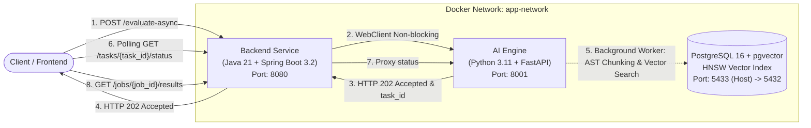

# Hệ Thống Đối Sánh Năng Lực Ứng Viên Qua Mã Nguồn GitHub (JD-Evidence-Matching)

> **Đề tài**: Đánh giá thực nghiệm chiến lược phân đoạn mã nguồn trong mô hình RAG hỗ trợ đối sánh năng lực ứng viên.  
> **Kiến trúc**: Microservices / Containerized (Spring Boot 3.2.x + FastAPI + PostgreSQL 16 pgvector).

---

## 📌 1. Giới thiệu tổng quan

Hệ thống **JD-Evidence-Matching** tự động đánh giá năng lực lập trình viên bằng cách đối sánh yêu cầu công việc trong Job Description (JD) với mã nguồn thực tế trên kho lưu trữ GitHub của ứng viên (thay vì chỉ dựa vào CV truyền thống).

### ✨ Điểm nổi bật kỹ thuật:
- **Phân đoạn mã nguồn thông minh (AST Chunking)**: Sử dụng **Tree-sitter** phân tích cây cú pháp trừu tượng cấp hàm/phương thức cho Java, JavaScript, TypeScript kèm Context Header.
- **Cơ chế chuyển tầng dự phòng (Fallback Line-based)**: Tự động chuyển sang phân đoạn theo khối dòng (60 dòng, overlap 10 dòng) khi file nguồn có lỗi cú pháp.
- **Tìm kiếm ngữ nghĩa (pgvector HNSW Index)**: Nhúng vector đa ngôn ngữ 1024 chiều (BGE-M3) kết hợp thuật toán Cosine Distance HNSW (`m=16, ef_construction=64`) để tìm kiếm bằng chứng mã nguồn Top-K với độ trễ cực thấp.
- **Kiến trúc xử lý bất đồng bộ (Non-blocking Flow)**: Phản hồi ngay lập tức `HTTP 202 Accepted` (< 100ms), xử lý ngầm qua worker và hỗ trợ client polling cập nhật thanh tiến độ theo thời gian thực.
- **Tự động hóa CI/CD**: Kiểm thử tự động trên GitHub Actions (Maven, Pytest, Docker build) và xuất bản container images lên GitHub Packages (GHCR).

---

## 🏛️ 2. Kiến trúc hệ thống (System Architecture)



---

## 📂 3. Cấu trúc thư mục dự án

```text
jd-evidence-matching/
├── .github/
│   └── workflows/
│       ├── ci.yml                 # Pipeline CI (Maven test, Pytest, Docker validation)
│       └── cd.yml                 # Pipeline CD (Build & Push Docker images to GHCR)
├── ai-engine/                     # Dịch vụ AI & Xử lý ngôn ngữ tự nhiên
│   ├── parser/
│   │   └── tree_sitter_loader.py  # Bộ bóc tách AST & Fallback Line-based
│   ├── routers/                   # API Endpoints (matching, jobs)
│   ├── services/                  # Background worker pipeline
│   ├── tests/                     # Bộ kiểm thử Pytest (Parser & API)
│   ├── Dockerfile
│   └── requirements.txt
├── backend-service/               # Dịch vụ Quản trị nghiệp vụ & Điều phối
│   ├── src/main/java/com/matching/# Controller, Service, Repository, DTO, Entity
│   ├── src/test/java/             # Bộ kiểm thử tích hợp luồng (Spring Boot Test)
│   ├── Dockerfile
│   └── pom.xml                    # Cấu hình Maven & dependencies
├── database/
│   └── init/
│       └── 01-Schema.sql          # Khởi tạo 5 bảng CSDL & HNSW vector index
├── .env.example                   # Mẫu cấu hình biến môi trường
├── docker-compose.yml             # Cấu hình khởi chạy toàn bộ 3 dịch vụ
└── README.md
```

---

## 🚀 4. Hướng dẫn khởi chạy khi Clone về

### 📋 Yêu cầu tiên quyết (Prerequisites)
- Đã cài đặt **Docker Desktop** (bắt buộc).
- (Tùy chọn nếu muốn chạy thử nghiệm không dùng Docker): JDK 21+, Python 3.11+, Maven 3.9+.

---

### Bước 1: Clone kho lưu trữ
```bash
git clone https://github.com/<your-username>/jd-evidence-matching.git
cd jd-evidence-matching
```

### Bước 2: Thiết lập file môi trường `.env`
Sao chép file mẫu `.env.example` thành `.env`:
- Trên Windows (PowerShell):
  ```powershell
  Copy-Item .env.example .env
  ```
- Trên Linux / macOS:
  ```bash
  cp .env.example .env
  ```

*(Bạn có thể mở file `.env` để điền `GEMINI_API_KEY` nếu muốn kích hoạt chấm điểm với mô hình LLM thật)*.

### Bước 3: Khởi chạy hệ thống bằng Docker Compose
Chỉ cần chạy 1 câu lệnh duy nhất:
```bash
docker compose up -d --build
```

Lệnh này sẽ tự động:
1. Khởi động PostgreSQL 16 với pgvector, tự động nạp bảng và vector index từ `01-Schema.sql`.
2. Build và khởi động dịch vụ `ai-engine` (FastAPI) trên cổng `8001`.
3. Build và khởi động dịch vụ `backend-service` (Spring Boot 3.x) trên cổng `8080`.

### Bước 4: Kiểm tra trạng thái hoạt động
```bash
docker compose ps
```
Cả 3 container `jd_matching_postgres`, `jd_matching_fastapi`, `jd_matching_springboot` đều có trạng thái `Up` (hoặc `healthy`).

---

## 🌐 5. Cổng dịch vụ & Tài liệu API

| Dịch vụ | Địa chỉ URL | Mô tả |
| :--- | :--- | :--- |
| **Backend Swagger UI** | [http://localhost:8080/swagger-ui/index.html](http://localhost:8080/swagger-ui/index.html) | Tài liệu trực quan API nghiệp vụ của hệ thống |
| **Backend Health Check** | [http://localhost:8080/actuator/health](http://localhost:8080/actuator/health) | Giám sát trạng thái hoạt động của Spring Boot & DB |
| **AI Engine API Docs** | [http://localhost:8001/docs](http://localhost:8001/docs) | Swagger tài liệu API phân tích AI & AST |
| **AI Engine Health Check**| [http://localhost:8001/health](http://localhost:8001/health) | Giám sát trạng thái hoạt động của AI Engine |
| **PostgreSQL (pgvector)** | `localhost:5433` | CSDL pgvector (User: `postgres`, Pass: `password_db_secret`, DB: `jd_matching_db`) |

> **Lưu ý về cổng Database**: Để tránh xung đột với các phiên bản PostgreSQL có sẵn trên máy (cổng mặc định `5432`), cổng ngoài máy Host được ánh xạ là **`5433`**. Các dịch vụ nội bộ Docker giao tiếp với nhau qua cổng mặc định `5432`.

---

## 🧪 6. Thử nghiệm luồng đối sánh mẫu (Quick Test)

Bạn có thể chạy thử luồng bất đồng bộ mẫu qua **PowerShell**:

### 1. Kích hoạt phân tích kho mã nguồn ứng viên
```powershell
$body = @{
    job_id = "e1f1c2b3-a4d5-6e7f-8a9b-0c1d2e3f4a5b"
    candidate_name = "Nguyễn Văn A"
    github_repo_url = "https://github.com/octocat/Hello-World"
    commit_hash = "7fd1a60b01f91b314f59955a4e4d4e80d8edf11d"
} | ConvertTo-Json

Invoke-RestMethod -Uri "http://localhost:8080/api/v1/matching/evaluate-async" -Method Post -ContentType "application/json" -Body $body | ConvertTo-Json
```
*Phản hồi ngay lập tức `HTTP 202 ACCEPTED` kèm `task_id`.*

### 2. Tra cứu tiến độ (Polling)
```powershell
# Thay {task_id} bằng ID nhận được từ bước trên
Invoke-RestMethod -Uri "http://localhost:8080/api/v1/matching/tasks/{task_id}/status" -Method Get | ConvertTo-Json
```
*Tiến độ sẽ nhảy từ `PROCESSING (20%)` đến `COMPLETED (100%)`.*

### 3. Lấy kết quả xếp hạng và bằng chứng code
```powershell
Invoke-RestMethod -Uri "http://localhost:8080/api/v1/matching/jobs/e1f1c2b3-a4d5-6e7f-8a9b-0c1d2e3f4a5b/results" -Method Get | ConvertTo-Json -Depth 5
```
*Trả về bảng điểm, chi tiết từng kỹ năng kèm trích đoạn code (`evidence_code_chunk`) và lời giải thích của AI.*

---

## 🔬 7. Chạy kiểm thử tự động (Unit / Integration Tests)

### Chạy test Backend (Spring Boot):
```bash
cd backend-service
# Trên Windows:
.\mvnw.cmd test
# Trên Linux/macOS:
./mvnw test
```
*(Kết quả: 6/6 test cases kiểm thử luồng tích hợp, validation và xử lý ngoại lệ thành công).*

### Chạy test AI Engine (FastAPI & AST):
```bash
cd ai-engine
pip install -r requirements.txt
pytest -v
```
*(Kết quả: 7/7 test cases kiểm thử bóc tách AST Java, JavaScript, Fallback line-based và các endpoint API thành công).*

---

## 🛠️ 8. Dừng và gỡ bỏ hệ thống

Để dừng toàn bộ dịch vụ:
```bash
docker compose down
```

Nếu muốn xóa sạch cả dữ liệu database trong volume để làm mới hoàn toàn:
```bash
docker compose down -v
```

---

## 📊 9. Thực nghiệm & Replication Package (SANER 2027 ERA)

Dự án cung cấp gói dữ liệu và kịch bản thực nghiệm tái lập độc lập phục vụ bài báo khoa học tại IEEE SANER 2027 ERA:
- **Tập truy vấn**: 25 Job Descriptions công nghệ thực tế (15 Java, 10 React/TypeScript) đóng băng tại `dataset/queries_frozen.json`.
- **Tập minh chứng mã nguồn**: 40 GitHub repositories với 189 source files định danh tại `dataset/ground_truth_500_master.csv`.
- **Bộ nhãn chuyên gia (Gold Ground Truth)**: 250 cặp (JD, code chunk) gán nhãn 3 mức (0, 1, 2) bởi 2 annotator độc lập với độ đồng thuận Quadratic Weighted Cohen's Kappa = 0.88 tại `dataset/ground_truth_final.csv` (SHA-256 locked).
- **Thiết kế thực nghiệm 2×2**: So sánh chiến lược phân đoạn {AST Method-level, Line-based 50 LOC} × Ngữ cảnh {Không Header, Có Header} trên 3 tầng truy xuất (BM25, BGE-M3 Dense, BGE-Reranker-Base) tuân thủ bộ quy tắc R1–R46 và `analysis_plan.md`.

